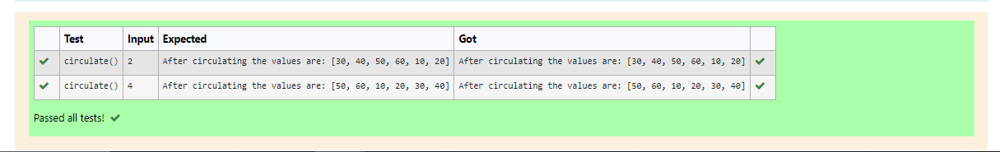

# Circulate-the-values-of-N-variables
## Aim:
To write a python program to circulate the n variables using function concept
## Equipment’s required:
PC
Anaconda - Python 3.7
## Algorithm: 
### Step 1: 
Define a function circulate()
### Step 2:
Assign the valuse as a list
### Step 3: 
Get the value from the user for the number of rotation
### Step 4: 
Using the slicing concept rotate the list
### Step 5: 
Assign a variable after slicing and print tha value
### Step 6: 
End the program
## Program:
```
#Program to circulate N values.
#Developed by: S.S.Sanjay Kumar
#RegisterNumber:21005845
def circulate():
    l=[10,20,30,40,50,60]
    n=int(input())
    a=l[n:]+l[:n]
    print('After circulating the values are:',a)
```

## Output:


## Result:
Thus the circulating the N values is successfully executed.
